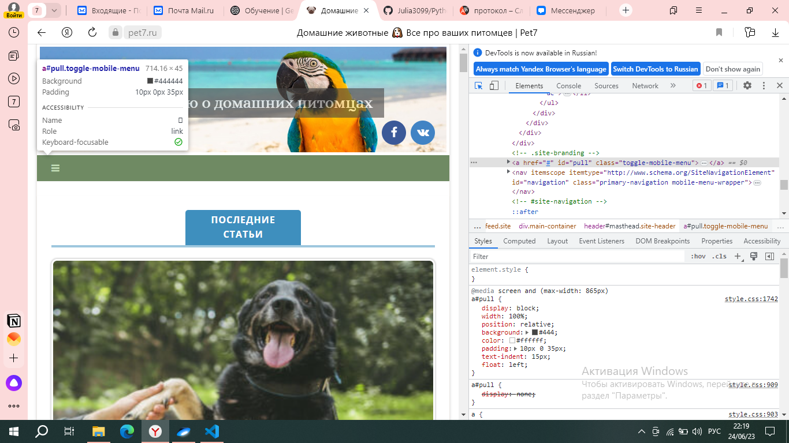
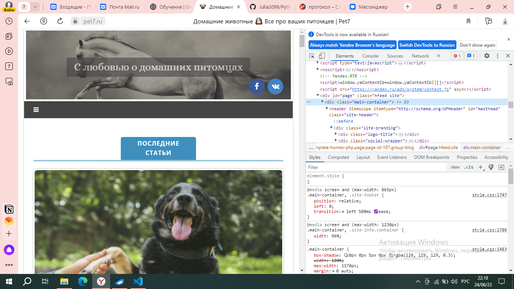
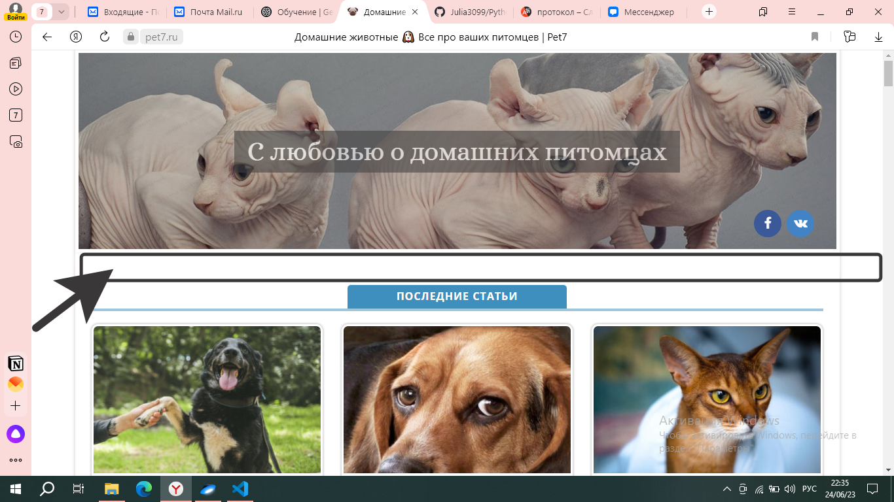

# Знакомство с веб-технологиями. Домашнее задание №1
## Задача: на основе сайта https://pet7.ru/
- Определите, на каком протоколе работает сайт.
- Проанализируйте структуру страницы сайта.
- Внесите не менее 3 изменений на страницу с помощью инструмента разработчика и представьте скриншоты было/стало.
- Создайте прототип низкой детализации.

1. Сайт работает на протоколе **https**

2. Структура

* header

* menu

* contain

* footer

3. Изменения

3.1. 

3.2.

3.3. 

4. Прототип низкой детализации

